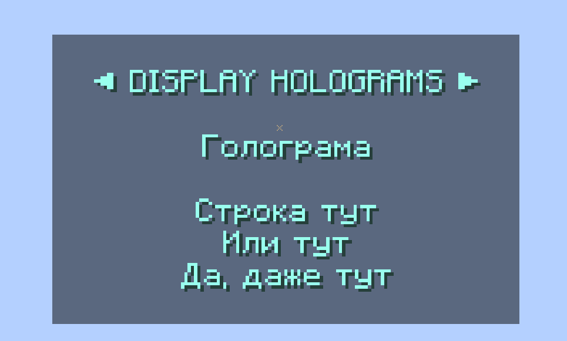

# DisplayHolograms


Легковесный и эффективный плагин на голограммы для Minecraft (Paper API), использующий сущности Text Display.

## Особенности
Использует нативные сущности `TEXT_DISPLAY` версии 1.19.4+. 

Минимизирует нагрузку на основной поток сервера.
Все сообщения вынесены в `messages.yml` и поддерживают MiniMessage.

Удобный просмотр голограмм и кнопками навигации.
Поддержка временных голограмм и отложенного создания.
Полная поддержка управления голограммами из других плагинов.

## Команды
- `/dish create <id> <текст>` — Создать новую голограмму.
- `/dish edit <id> <текст>` — Изменить текст существующей голограммы.
- `/dish remove <id>` — Удалить голограмму.
- `/dish move <id> <x> <y> <z>` — Переместить голограмму по координатам.
- `/dish movehere <id>` — Переместить голограмму к вам.
- `/dish teleport <id>` — Телепортироваться к голограмме.
- `/dish list [страница]` — Посмотреть список всех голограмм (по 10 на страницу).
- `/dish reload` — Перезагрузить конфигурацию и сообщения.

## Установка
1. Скачайте последнюю версию `.jar` файла.
2. Поместите его в папку `plugins` вашего сервера.
3. Перезапустите сервер.

## Для разработчиков (API)

Для интеграции с плагином используйте `DisplayHologramsAPI`.

### Получение API
```java
DisplayHologramsAPI api = DisplayHologramsPlugin.getApi();
```

### Примеры кода

#### Создание голограмм
```java
// Вечная голограмма (сохраняется в конфиг)
api.createHologram("welcome", location, "Привет, мир!");

// Сессионная голограмма (живет до перезагрузки, не сохраняется в конфиг)
api.createHologram("session", location, "Только на этот сеанс", 0L);

// Временная голограмма (удалится через 100 тиков / 5 секунд)
api.createHologram("temp", location, "Я исчезну скоро", 100L);

// Отложенное создание (появится через 3 секунды и будет вечной)
api.createHologramDelayed("delayed", location, "Появился позже!", 60L, -1L);
```

#### Управление и проверка
```java
// Изменение текста
api.updateHologram("id", "Новый текст");

// Перемещение в новую локацию
api.moveHologram("id", newLocation);

// Удаление
api.removeHologram("id");

// Проверка на существование
if (api.hasHologram("id")) {
    // Голограмма найдена
}

// Получение списка всех ID
Collection<String> allIds = api.getHologramIds();
```

#### Перезагрузка
```java
// Возвращает true при успешной перезагрузке
if (api.reload()) {
    // Плагин перезагружен
}
```

## Лицензия
GNU General Public License v3.0
